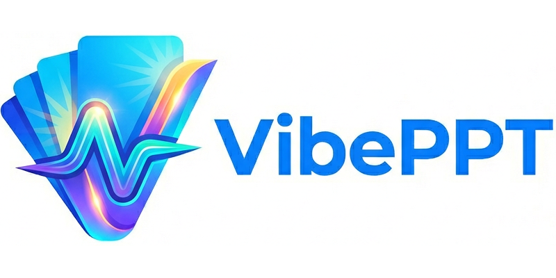

<div align="center">
  
</div>

<div align="center">
  <a href="https://buymeacoffee.com/giacomov"></a>
</div>

An AI-native slide deck builder: prompts in, slides out. Highly customizable. 

https://github.com/user-attachments/assets/bad693b2-c46b-407c-9d8a-8d16c6d073c7

**Result:**

https://github.com/user-attachments/assets/73025fde-8353-4c68-b85d-5ee7b10a68f9

### Try youself in Claude Code:

From within the `vibeppt` folder:
```
claude --permission-mode auto "/create-presentation about this https://karpathy.bearblog.dev/year-in-review-2025/"
```
or just run claude code and enter the prompt "/create-presentation about this https://karpathy.bearblog.dev/year-in-review-2025/" from within CC.

### Same thing with Cursor agent

```
> agent --model claude-sonnet-4-6 --output-format text --yolo -p "/create-presentation about https://karpathy.bearblog.dev/year-in-review-2025"
The `karpathy-2025` deck is ready — 16 slides covering all six of Karpathy's paradigm shifts. Here's what was built:

**Slide structure:**
1. **Title** — "2025 LLM Year in Review"
2. **Agenda** — SplitFlapBulletSlide with the 6 shifts
3. **Section: Training Paradigms**
4. **RLVR** — PrismSlide decomposing the new training stack (Pretraining → SFT → RLHF → RLVR)
5. **Jagged Intelligence** — TemperatureSlide (Confused grade-schooler ↔ Genius polymath)
6. **Don't Trust Benchmarks** — KeyTakeawaySlide (3 punchy points)
7. **Section: LLM Applications**
8. **Cursor / LLM App Layer** — PrismSlide (context engineering, orchestration, GUI, autonomy slider)
9. **Claude Code** — CardSlide (4 playing cards: localhost, loopy reasoning, low latency, spirit on your box)
10. **Section: Vibe Coding**
11. **The Vibe Coding Loop** — CycleSlide (Describe → Ship → Discard)
12. **Who Benefits Most?** — CompareSlide (Regular People vs Trained Professionals)
13. **Section: LLM GUI**
14. **LLM GUI Evolution** — StackSlide (Raw Text → Markdown → Multimodal)
15. **TLDR** — KeyTakeawaySlide with Karpathy's closing lines
16. **The End**
```

# In short

Give a coding agent (Claude Code, Cursor, etc.) a topic, and it produces a complete presentation — slides, animations, speaker notes — that you can then refine through conversation or code. 

Or, built it slide by slide. Since it just React + TypeScript, your coding agents will feel right at home. If the available templates aren't enough, you can just vibe code your own and they will fit right in.

It supports:
* Text-to-presentation: just one prompt for one presentation. The agent will: create an outline -> create the slides -> render them -> analyze them and fix any error -> end. The agent will loop until all errors (coding or layout) are fixed.
* Text-to-slide: you can create one slide at the time by just prompting your favorite tool (cursor, claude code, codex...) like "Create a new slide with the following content: ...". You can also ask it to create a new custom visualization, animation, and so on. Templates can help you start very quickly, but the sky is the limit. Just ask what you want like you would in any vibe coding situation.

You can then change anything you want by prompting or modifying the code.

Presentations are React + TypeScript components assembled from a template library (or custom-built with your favorite vibe coding tool), styled through a design token system, and rendered in a fixed 16:9 frame.

## Getting started

Ask your favorite chatbot/agent to install `npm` for you and to clone this repo. For example, you can copy/paste this in Claude Code or Cursor (or any other coding agent):

```
Verify that I have `npm` available, and if not install it for me. 

Then clone the repository https://github.com/giacomov/vibeppt and create within it a presentations/ folder (will contain my presentations).

Finally install the required dependencies with `npm install` and run with `npm run dev`.
```

Then go to your browser at `http://localhost:5173/` to have a look at the demo presentations.

Whey you are ready to make your own, use `/create-presentation` (see next section).

## Creating presentations

You can find demo presentations under `demos/`. Your presentations must go under `presentations/` in the root of the folder.

### With an AI agent (recommended)

Use the `/create-presentation` slash command in Claude Code or Cursor. The agent reads `CLAUDE.md` / `AGENTS.md` for full instructions on the template library, file layout, and style rules.

### Slide by slide

Ask the agent to add or change individual slides:

```
Add a slide after slide 3 comparing RLHF vs RLVR — use CompareSlide.
```

```
The agenda slide feels too static. Replace it with a SplitFlapBulletSlide.
```

### Custom slides beyond the templates

Because slides are plain React components, you can vibe-code anything that doesn't fit a template:

```
Create a new slide with an animated neural network diagram — three input nodes,
two hidden nodes, one output node, edges drawn with SVG, weights animating in
on mount.
```

### Iterating

If you don't like what the agent produced, just say so:

```
The title slide feels too corporate. Make it more technical.
The chart on slide 5 should be a line chart, not a bar chart.
Slide 8 has too much text — cut it in half.
```

Everything is code, so you can also edit `.tsx` files directly if you prefer.

### Integration with other tools

Since this runs inside your favorite coding agent, you can mix it with the other tools available there. Some ideas:

* `/create-presentation Fetch my confluence page ... with the Atlassian MCP server and create a presentation about it`
* `Do a deep research about [topic]` then `/create-presentation about this`.
* ...

I find that the most flexible way is to create an intermediate markdown document _before_ you start working on the presentation. You can create this intermediate document any way you want, so you can assemble parts from multiple sources. Then you can create the documentation starting from there. If you need changes, change the document first, then ask the agent (Claude Code or Cursor) to update the presentation accordingly.

You can even do self-updating presentations by using the cron capabilities of these tools.

### Export slides

Any presentation you make can be exported as a PDF or as separate images (one per slide):

```bash
npm run export -- --deck=<name> --format=png   # PNGs to exports/<name>/
npm run export -- --deck=<name> --format=pdf   # single PDF
npm run export -- --deck=<name> --format=both
```

---

## Technical: How it works

**Slides are just React components.** Each slide is a `.tsx` file that returns a `ReactNode`. A `deck.ts` manifest imports and orders them. The app auto-discovers all decks under `presentations/` — no config needed.

**Templates are the vocabulary.** A library of pre-built animated layouts (`BulletSlide`, `FlowSlide`, `CompareSlide`, `CardSlide`, `CycleSlide`, `PrismSlide`, and more) covers most content types. Agents are instructed to pick the best template for the content rather than defaulting to bullets.

**Theming is token-based.** Colors and fonts live in `src/theme/tokens.ts` and flow through Tailwind. Each deck can override the accent color without touching other decks.


## Project layout

```
presentations/          <- your decks live here
  [deck-name]/
    deck.ts             <- manifest: imports + orders slides
    title.tsx
    ...

src/
  templates/            <- reusable slide layouts
  components/           <- app chrome (renderer, navigation, presenter UI)
  theme/tokens.ts       <- global design tokens
  types/slide.ts        <- SlideComponent, Deck types

scripts/
  export-slides.mjs     <- Playwright-based PNG/PDF exporter
```

---

## Stack

- React 19 + TypeScript
- Vite
- Tailwind CSS
- Recharts (charts)
- React Flow / Dagre (flow diagrams)
- Lucide React (icons)
- Playwright (export)
